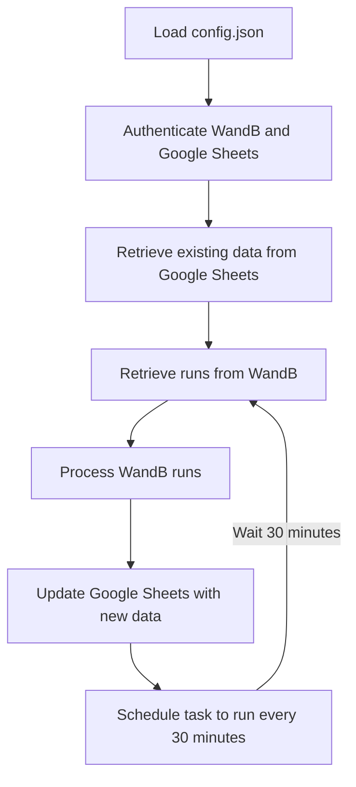

# 프로젝트 설명: W&B 데이터를 Google 스프레드시트로 전송

이 프로젝트는 실행 중인 Wandb 실험을 불러오고, 전송하고 싶은 Machine Learning 또는 Deep Learning 실험 데이터를 지정한 뒤에 Google Spreadsheet로 정리하여 기록합니다. W&B API를 통해 프로젝트의 실험 데이터를 가져오고, Google Sheets API를 사용하여 실험 데이터를 Google 스프레드시트에 저장할 수 있습니다. 실행 예시는 아래와 같습니다.

| Run ID | Timestamp | User | Model Type | Learning Rate | Batch Size | Epochs | Training Loss | Validation Loss | Accuracy | GPU Memory |
|--------|-----------|------|------------|---------------|------------|---------|---------------|-----------------|-----------|------------|
| 2xk8p9n0 | 2024-11-20 14:30:15 | YourName | ResNet50 | 0.001 | 32 | 100 | 0.245 | 0.312 | 0.892 | 5.6GB |
| 7mq2r5v3 | 2024-11-20 15:45:22 | YourName | ResNet101 | 0.0005 | 64 | 150 | 0.198 | 0.287 | 0.901 | 8.2GB |
| 9kt4h8w1 | 2024-11-20 17:20:03 | YourName | EfficientNet | 0.001 | 32 | 80 | 0.267 | 0.295 | 0.885 | 4.8GB |
| 3np6j2x5 | 2024-11-20 19:10:45 | YourName | VGG16 | 0.0001 | 16 | 120 | 0.312 | 0.358 | 0.878 | 6.4GB |



## 주요 기능
- W&B에서 가져온 실험 데이터를 Google 스프레드시트에 자동으로 업데이트.
- 기존 데이터와 중복되지 않는 실험 데이터만 추가하여 기록.
- 고정된 헤더 및 동적 헤더를 구성하여 실험 데이터를 시각적으로 깔끔하게 정리.
- NaN 값 처리 및 특수 문자 제거 기능 포함.
- spreadsheet에서 수정한 값이 업데이트에 반영됨


## 요구사항

### 필수 라이브러리

1. **WandB** - W&B API를 사용하여 데이터를 가져옵니다.
2. **gspread** - Google Sheets API를 통해 스프레드시트에 접근하고 데이터를 수정합니다.
3. **oauth2client** - Google 서비스 인증에 사용됩니다.

다음 명령어를 사용하여 라이브러리를 설치할 수 있습니다.

```bash
pip install wandb gspread oauth2client
```
or
```python
pip install -r requirements.txt
```

### 필요 파일

1. **Google Cloud Platform JSON 파일**: Google Sheets API에 접근하기 위해서는 Google Cloud에서 인증 파일(서비스 계정 키 JSON 파일)을 다운로드해야 합니다.
2. **W&B API Key**: W&B API에 접근하기 위한 API 키가 필요합니다.

## 사용 방법

1. **Google Sheets API 설정**
   - [Google Cloud Console](https://console.cloud.google.com/)에서 Google Sheets API를 활성화하고 서비스 계정을 생성한 후 JSON 키 파일을 다운로드합니다.
   - 프로젝트 디렉토리에 JSON 파일을 저장합니다.

2. **W&B API 설정**
   - W&B 계정에 로그인한 후 [API 페이지](https://wandb.ai/authorize)에서 API 키를 생성합니다.
   - 해당 API 키를 스크립트에 입력합니다.

3. **config.json 설정**
   - `FIXED_HEADERS` : Spreadsheet에 기록할 header(column)을 지정합니다.
   - `GCP_JSON`에 인증 파일 경로를 설정합니다.
   - `SPREADSHEET_NAME`에 구글 스프레드 시트 이름을 설정합니다.

### 코드 구성

#### 1. **parse_args()**
   - Parser를 활용해서 입력 인자들을 조절할 수 있습니다.
   - W&B에 저장할 실험 데이터를 지정하고, GCP(Google Cloud Platform) API를 불러옵니다.
   - `schedule-time` : 30분 간격으로 실험 결과를 Spreadsheet로 전송합니다. 더 짧은 간격을 위해서는 유료 토큰이 필요합니다.
   - `sheet-name` : 실험 결과를 기록할 Spreadsheet의 이름을 지정합니다.
   - `user-name` : Spreadsheet에 기록할 사용자 이름을 지정합니다.

#### 2. **get_wandb_project_info()**
   - 현재 실행 중인 WandB 정보를 불러오고 project_name, entity_name을 반환합니다.

#### 3. **load_config()**
   - "GCP_JSON", "FIXED_HEADERS" 값이 존재하는지 확인하고 불러옵니다.
   - 만약 불러오지 못했다면, 관련 에러 메세지를 반환합니다.

#### 4. **init_sheet()**
   - 최대 100개 column 만큼의 값을 저장할 수 있는 Spreadsheet를 초기화합니다.
   - 초기화된 Spreadsheet에는 Wandb에서 진행 중인 실험 데이터가 저장됩니다.


#### 6. **sync_data()**
   - 저장된 Wandb 실험 데이터를 Config 정보를 활용해 Google Spreadsheet로 전송합니다.
   - 만약 전송할 수 없다면, 관련 에러 메세지를 반환합니다.

#### 7. **main()**
   - 전체 실행 과정이 포함된 메인 함수입니다.
   - Google Sheets에서 기존 데이터를 가져와 중복되는지 확인하고, W&B에서 가져온 새로운 데이터를 스프레드시트에 추가합니다.

### 실행 방법

#### 스크립트 실행
1. Python 스크립트를 실행하기 전에 필요한 라이브러리와 인증 파일을 준비하세요.
2. 스크립트 내에 `wandb API Key` 및 `Google Cloud Platform JSON 파일` 경로를 설정한 후, 프로젝트와 관련된 설정값을 config.json에  입력하세요.
3. 스크립트를 실행하여 Google 스프레드시트에 W&B 실험 데이터를 업데이트합니다.

   ```bash
   python wandb_spreadsheet_sync.py
   ```

#### 도커 실행
1. Clone Repository
   ```bash
      git clone https://github.com/taeyoung1005/wandb-spreadsheet-sync.git
   ```

2. Image build
   ```bash
   docker build -t wandb_spreadsheet_sync .
   ```
3. Container Run
   ```bash
   docker run -d --name wandb_spreadsheet_sync wandb_spreadsheet_sync
   ```

### 출력
- 실행이 완료되면, W&B 실험 데이터가 Google 스프레드시트에 최신 상태로 업데이트됩니다.
- 출력 메시지로 성공 여부를 확인할 수 있습니다.
- 버그가 발생했다면, 해당 상황을 알 수 있도록 관련 내용을 함께 출력합니다.


## 주의 사항

1. **중복 데이터**: 이미 기록된 `run_id`는 다시 추가되지 않도록 설계되었습니다.
2. **API 제한**: Google Sheets API는 하루에 500만 개의 셀 업데이트로 제한되므로, 너무 자주 또는 대량의 데이터를 업데이트할 때는 주의해야 합니다.
3. **데이터 유실 방지**: 스크립트 실행 전 스프레드시트의 백업을 권장합니다.