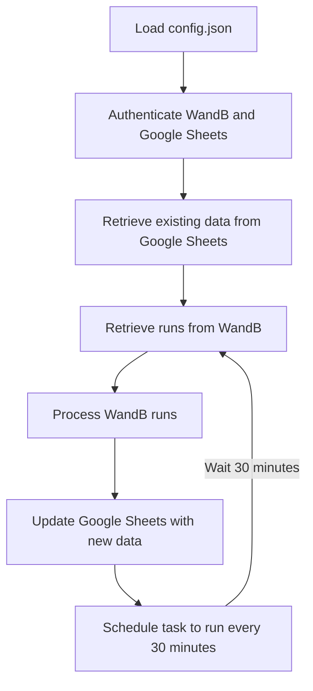

# 프로젝트 설명: W&B 데이터를 Google 스프레드시트로 전송

이 프로젝트는 WandB(W&B; Weights & Biases)에서 머신러닝 모델 실험 데이터를 자동으로 가져와 Google 스프레드시트에 정리하여 기록하는 Python 스크립트입니다. W&B API를 통해 프로젝트의 실험 데이터를 가져오고, Google Sheets API를 사용하여 실험 데이터를 Google 스프레드시트에 저장할 수 있습니다.



## 주요 기능

- W&B에서 가져온 실험 데이터를 Google 스프레드시트에 자동으로 업데이트.
- 기존 데이터와 중복되지 않는 실험 데이터만 추가하여 기록.
- 고정된 헤더 및 동적 헤더를 구성하여 실험 데이터를 시각적으로 깔끔하게 정리.
- NaN 값 처리 및 특수 문자 제거 기능 포함.
- spreadsheet에서 수정한 값이 업데이트에 반영됨 

## 요구사항

### 필수 라이브러리

1. **WandB** - W&B API를 사용하여 데이터를 가져옵니다.
2. **gspread** - Google Sheets API를 통해 스프레드시트에 접근하고 데이터를 수정합니다.
3. **oauth2client** - Google 서비스 인증에 사용됩니다.

다음 명령어를 사용하여 라이브러리를 설치할 수 있습니다.

```bash
pip install wandb gspread oauth2client
```
or
```python
pip install -r requirements.txt
```

### 필요 파일

1. **Google Cloud Platform JSON 파일**: Google Sheets API에 접근하기 위해서는 Google Cloud에서 인증 파일(서비스 계정 키 JSON 파일)을 다운로드해야 합니다.
2. **W&B API Key**: W&B API에 접근하기 위한 API 키가 필요합니다.

## 사용 방법

1. **Google Sheets API 설정**
   - [Google Cloud Console](https://console.cloud.google.com/)에서 Google Sheets API를 활성화하고 서비스 계정을 생성한 후 JSON 키 파일을 다운로드합니다.
   - 프로젝트 디렉토리에 JSON 파일을 저장합니다.

2. **W&B API 설정**
   - W&B 계정에 로그인한 후 [API 페이지](https://wandb.ai/authorize)에서 API 키를 생성합니다.
   - 해당 API 키를 스크립트에 입력합니다.

3. **config.json 설정**

   - `NAME` 딕셔너리에서 사용자의 W&B ID와 이름을 매핑해 줍니다.
   - 스프레드시트에서 컬럼의 순서를 바꾸고 싶을 경우 `FIXED_HEADERS`를 수정하면 됩니다.
   - `API_KEY` 에 W&B API 키를 입력합니다.
   - `GOOGLE_CLOUD_PLATFORM_JSON`에 인증 파일 경로를 설정합니다.
   - `SPREADSHEET_NAME`에 구글 스프레드 시트 이름을 설정합니다.
   - `TEAM_NAME`에 W&B 팀 이름을 설정합니다.
   - `PROJECT_NAME`에 W&B 프로젝트 이름을 설정합니다.

### 코드 구성

#### 1. **config()**
   - W&B API 및 Google Sheets API를 설정합니다.
   - W&B에서 실험 데이터를 가져오고, Google 스프레드시트를 엽니다.

#### 2. **clean_field_name()**
   - 필드 이름에서 슬래시("/")와 같은 특수 문자를 제거하여 스프레드시트에 적합한 이름으로 변환합니다.

#### 3. **get_existing_run_ids()**
   - Google 스프레드시트에서 기존에 저장된 데이터를 불러와 `run_id` 리스트를 반환합니다.
   - 중복된 실험 데이터를 방지하기 위한 기능입니다.

#### 4. **convert_row_to_str()**
   - 스프레드시트의 데이터를 문자열로 변환하며, `NaN` 값이 있을 경우 빈 문자열로 처리합니다.

#### 5. **get_dynamic_headers()**
   - W&B 실험 데이터에서 `config` 및 `summary` 정보를 가져와 동적 헤더를 추출합니다.
   - 고정된 헤더와 결합하여 최종 헤더를 생성합니다.

#### 6. **process_wandb_data()**
   - W&B 데이터를 처리하여 실험 결과를 `run_id`, `timestamp`, `name`과 함께 정리된 행으로 반환합니다.
   - 고정된 헤더 외에도 실험 설정(`config`) 및 결과(`summary`) 데이터를 포함합니다.

#### 7. **main()**
   - 전체 실행 과정이 포함된 메인 함수입니다.
   - Google Sheets에서 기존 데이터를 가져와 중복을 체크하고, W&B에서 가져온 새로운 데이터를 스프레드시트에 추가합니다.

### 실행 방법

#### 스크립트 실행
1. Python 스크립트를 실행하기 전에 필요한 라이브러리와 인증 파일을 준비하세요.
2. 스크립트 내에 `wandb API Key` 및 `Google Cloud Platform JSON 파일` 경로를 설정한 후, 프로젝트와 관련된 설정값을 config.json에  입력하세요.
3. 스크립트를 실행하여 Google 스프레드시트에 W&B 실험 데이터를 업데이트합니다.

   ```bash
   python wandb_spreadsheet_sync.py
   ```

#### 도커 실행
1. Clone Repository
   ```bash
      git clone https://github.com/taeyoung1005/wandb-spreadsheet-sync.git
   ```

2. Image build
   ```bash
   docker build -t wandb_spreadsheet_sync .
   ```
3. Container Run
   ```bash
   docker run -d --name wandb_spreadsheet_sync wandb_spreadsheet_sync
   ```

### 출력
- 실행이 완료되면, W&B 실험 데이터가 Google 스프레드시트에 최신 상태로 업데이트됩니다.
- 출력 메시지로 성공 여부를 확인할 수 있습니다.

   ```text
   W&B 데이터를 내림차순으로 헤더와 함께 Google 스프레드시트에 추가했습니다.
   ```

## 주의 사항

1. **중복 데이터**: 이미 기록된 `run_id`는 다시 추가되지 않도록 설계되었습니다.
2. **API 제한**: Google Sheets API는 하루에 500만 개의 셀 업데이트로 제한되므로, 너무 자주 또는 대량의 데이터를 업데이트할 때는 주의해야 합니다.
3. **데이터 유실 방지**: 스크립트 실행 전 스프레드시트의 백업을 권장합니다.